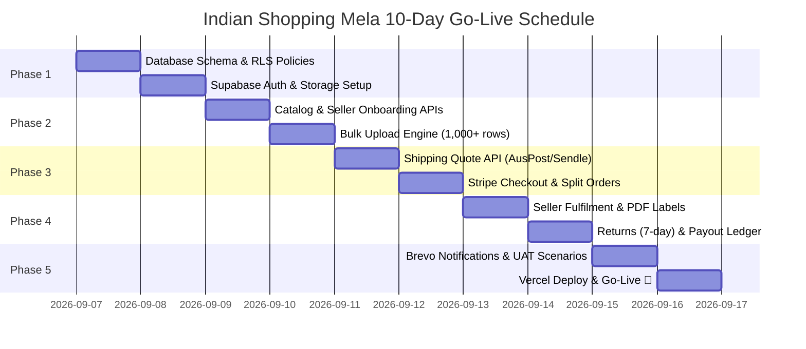

# Indian Shopping Mela — Phased 5–10 Day Delivery Plan

> **Baseline Document**: [Developer Architecture Master Plan (V1)](file:///d:/AI/Indian%20Shopping%20Mela/resources/Indian_Shopping_Mela_Developer_Architecture_Master_Plan_V1.pdf)  
> **Master Tasklist**: [resources/tasklist.md](file:///d:/AI/Indian%20Shopping%20Mela/resources/tasklist.md)  
> **Master Roadmap**: [resources/roadmap.md](file:///d:/AI/Indian%20Shopping%20Mela/resources/roadmap.md)  
> **Confirmed Architecture Decisions**:
>
> - **Stack**: TanStack Start + Supabase (PostgreSQL + RLS + Auth + Storage) + Vercel.
> - **Tax & GST**: Australian Standard (10% GST-inclusive pricing, 1/11th GST itemized with Marketplace ABN).
> - **Payments & Payouts**: Stripe AU Direct + Platform Escrow Ledger + 14-day post-delivery unlock + ABA/CSV bank payouts.
> - **Shipping**: Live Australia Post eParcel / Sendle API + Manual courier tracking fallback on downtime.
> - **Inventory Concurrency**: 15-minute temporary reservation at checkout + final atomic decrement on payment webhook.
> - **Bulk Upload Engine**: Serverless Chunked Batch Processor (100–200 rows/batch) + downloadable CSV error reports.
> - **Notifications**: Brevo API for transactional emails (order confirmation, tax invoices, tracking links, seller alerts).

---

## Phase Overview

---

## Phase 1: Database, Security & Core Infrastructure (Days 1–2)

### Goals:

- Deliver rock-solid PostgreSQL schema, Row-Level Security, Supabase Auth, and Storage CDN.

### Deliverables:

1. **PostgreSQL Migrations**:
   - `profiles`, `sellers`, `seller_staff`, `categories`, `attributes`, `products`, `product_variants`, `product_media`.
   - `orders`, `sub_orders`, `order_items`, `payout_ledger`, `return_requests`, `shipping_labels`, `audit_logs`, `webhook_events`.
2. **Row-Level Security (RLS)**:
   - Tenant isolation: Sellers cannot read or write data of other sellers.
   - Customers can only read and modify their own carts and orders.
3. **Supabase Storage**:
   - `product-media` (Public read, CDN cached, signed uploads).
   - `kyc-documents` (Private, Admin & Owner read only).
   - `shipping-labels` (Private, Seller & Admin read only).
4. **Auth Foundations**:
   - Setup `@supabase/ssr` with cookie sessions in TanStack Start.
   - Separate portal entrypoints: `/signin`, `/sell/onboarding`, `/admin`.

---

## Phase 2: Catalog, Seller Onboarding & Bulk Import (Days 3–4)

### Goals:

- Enable sellers to register, submit KYC, create single products, and bulk upload 1,000+ items via Excel/CSV.

### Deliverables:

1. **Seller Onboarding Flow**:
   - Save ABN, dispatch/return addresses, and bank payout details (BSB + Account Number).
   - Application status transitions (`DRAFT` → `SUBMITTED` → `APPROVED`).
2. **Dynamic Catalog & Search**:
   - Connect `src/routes/category.$slug.tsx` and `src/routes/search.tsx` to live Postgres queries.
   - Connect `src/routes/product.$id.tsx` with variant selectors, price calculation, and media viewer.
3. **Bulk Product Upload Worker (`/api/catalog/bulk-upload`)**:
   - Downloadable CSV and XLSX templates.
   - Serverless chunked batch processing (100–200 rows per batch, handles 1,000+ rows).
   - Row-by-row error report generation (downloadable CSV).
   - Create vs Update mode (`IGNORE` vs `CLEAR` blank cells).

---

## Phase 3: Shipping API, Cart & Multi-Seller Checkout (Days 5–6)

### Goals:

- Connect live shipping calculations, multi-seller cart splitting, and Stripe AU payment capture.

### Deliverables:

1. **Shipping Service Adapter (`IShippingProvider`)**:
   - Integration with **Australia Post eParcel** and **Sendle API** with manual fallback on courier downtime.
   - Live shipping rate calculation grouped per seller package based on weight/dimensions.
2. **Multi-Seller Checkout & Concurrency**:
   - 15-minute temporary inventory reservation at checkout entry.
   - Create Stripe AU `PaymentIntent` with 10% Australian GST breakdown.
3. **Stripe Webhook Handler (`/api/webhooks/stripe`)**:
   - Cryptographic signature validation & idempotency checks.
   - Atomic transaction:
     1. Creates Master Order (`orders`).
     2. Splits lines into seller Sub-Orders (`sub_orders` e.g., `ISM10001-A`, `ISM10001-B`).
     3. Decrements variant inventory atomically.
     4. Inserts immutable records into `payout_ledger` with `PAYOUT_HOLD`.

---

## Phase 4: Seller Fulfilment, Returns & Financial Ledger (Days 7–8)

### Goals:

- Enable seller order fulfilment with courier label generation, customer returns (7-day rule), and admin payout reconciliation.

### Deliverables:

1. **Seller Fulfilment Workflow (`/sell`)**:
   - Seller order management (Accept, Pack, Dispatch).
   - Generate & download courier PDF shipping label via live API (or manual tracking entry fallback).
   - Auto-attach tracking ID and set status to `LABEL_CREATED` / `SHIPPED`.
2. **Returns Engine (`/returns/new`)**:
   - Strict `delivery_date + 7 days` change-of-mind validation.
   - Customer photo upload for defective/damaged claims.
   - Immediate automatic `PAYOUT_HOLD` applied to corresponding seller sub-order ledger entry.
3. **Admin Financial Ledger (`/admin`)**:
   - Immutable financial entries tracking customer charges, platform commission, and net payouts.
   - Automated 14-day post-delivery unlock logic (`PAYOUT_ELIGIBLE`).
   - ABA / CSV batch export for Australian bank payouts.

---

## Phase 5: Notifications, UAT Testing & Production Launch (Days 9–10)

### Goals:

- Complete Brevo transactional messaging, execute mandatory UAT scenarios, and deploy live to Vercel.

### Deliverables:

1. **Brevo Notifications Engine**:
   - Customer Order Confirmation + Tax Invoice (10% GST itemized).
   - Seller New Order & Dispatch Alerts.
   - Customer Live Tracking & Delivery Confirmation.
2. **Mandatory UAT Scenarios (Master Plan §34)**:
   - 1,000-row bulk import with error report generation.
   - 3-seller multi-package checkout & split order testing.
   - Concurrent last-unit inventory purchase test (oversell prevention).
   - 7-day return submission & payout hold validation.
   - 14-day post-delivery payout eligibility verification.
   - Webhook idempotency test (duplicate payment/shipping events).
3. **Production Deployment**:
   - Deploy to Vercel with production environment variables.
   - Point custom domain with Cloudflare DNS + SSL.
   - Authenticate Brevo SPF/DKIM/DMARC records.
   - Go Live! 🚀
